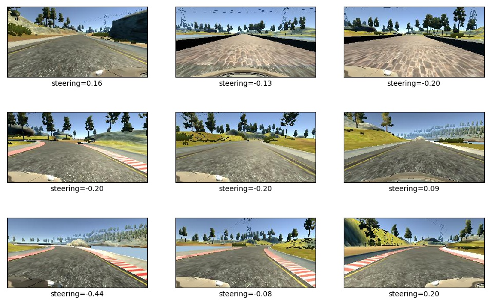

# Behavioral Cloning Project

The goals / steps of this project are the following:
* Use the simulator to collect data of good driving behavior
* Build, a convolution neural network in Keras that predicts steering angles from images
* Train and validate the model with a training and validation set
* Test that the model successfully drives around track one without leaving the road
* Summarize the results with a written report


[//]: # (Image References)

[image1]: ./examples/placeholder.png "Model Visualization"
[image2]: ./examples/placeholder.png "Grayscaling"
[image3]: ./examples/placeholder_small.png "Recovery Image"
[image4]: ./examples/placeholder_small.png "Recovery Image"
[image5]: ./examples/placeholder_small.png "Recovery Image"
[image6]: ./examples/placeholder_small.png "Normal Image"
[image7]: ./examples/placeholder_small.png "Flipped Image"

## Rubric Points
### Here I will consider the [rubric points](https://review.udacity.com/#!/rubrics/432/view) individually and describe how I addressed each point in my implementation.  

---
### Files Submitted & Code Quality

#### 1. Submission includes all required files and can be used to run the simulator in autonomous mode

My project includes the following files:
* model.py containing the script to create and train the model
* drive.py for driving the car in autonomous mode
* model.h5 containing a trained convolution neural network
* README.md or summarizing the results

#### 2. Submission includes functional code
Using the Udacity provided simulator and my drive.py file, the car can be driven autonomously around the track by executing
```sh
$ python drive.py model.h5
```

#### 3. Submission code is usable and readable

The model.py file contains the code for training and saving the convolution neural network. The file shows the pipeline I used for training and validating the model, and it contains comments to explain how the code works.

### Model Architecture and Training Strategy

#### 1. An appropriate model architecture has been employed

My model resembles NVIDIA's end-to-end learning network following the original paper [*End to End Learning for Self-Driving Cars*](https://arxiv.org/abs/1604.07316). Except dropout layers were added between fully connected layers to reduce overfitting.


The model includes RELU layers to introduce nonlinearity.

#### 2. Attempts to reduce overfitting in the model

The model contains dropout layers in order to reduce overfitting. The model was tested by running it through the simulator and ensuring that the vehicle could stay on the track.

#### 3. Model parameter tuning

The model used an [Adam](https://arxiv.org/abs/1412.6980) optimizer, so the learning rate was not tuned manually.

#### 4. Appropriate training data

Training data was chosen to keep the vehicle driving on the road.

I trained my model using the dataset that Udacity provides. I tried to create my own dataset by driving on the tracks. However, I feel it's very difficult to do so without good throttle control, especially for the second track. Moreover, the recovery behavior suggested in the course is rather difficult to collect by switching on/off the recording button. It's very easy to collect bad data and hard to cleanup those data.

For details about how I created the training data, see the next section.

### Model Architecture and Training Strategy

#### 1. Solution Design Approach

The overall strategy for deriving a model architecture was to adopt a well established network architecture. In this case the Nvidia's End-to-End network. To combat the overfitting, I inserted dropout layer between fully connected layers. With the augmentation of the training data, at the end of the process, the vehicle is able to drive autonomously around the track without leaving the road.

#### 2. Final Model Architecture

The final model architecture is the Nvidia's End-to-End network with dropout layers.

#### 3. Creation of the Training Set & Training Process

As mentioned above, I used the dataset that Udacity provided. I used the images from center camera and left/right cameras with adjusted steering angle for learning the recovery behavior. Since the vehicle is mostly driving in a straight line, we have a lot more training data with close zero measurements. To balance the data distribution, I randomly dropped 85% of the data with measurements less than 0.001. This important step creates a well distributed dataset as can be seen below.


Some sample images are shown here.



I then processed the data by cropping off the irrelevant top/bottom part of the image. Scale the size to (200, 66) as used in Nvidia's network architecture. And finally convert it to YUV color space as suggested in the original paper. Below shows the same sample images after preprocessing. Notice that at test time, we also need to do the same preprocessing.


To augment the data set, I also shifted the image left/right by random number of pixels (in the range of -20 to 20) and proportionally increase/decrease the steering angle. By doing this, the network should be able to seen a lot more images with different vehicle lateral positions. This can be seen by compare the below figure and the above.


The distorted images are then feed into the network for training through the generator. The validation set helped determine if the model was over or under fitting. I used an adam optimizer so that manually training the learning rate wasn't necessary. The network is trained for 10 epochs and the training and validation loss (in log scale) can be visualized below.


